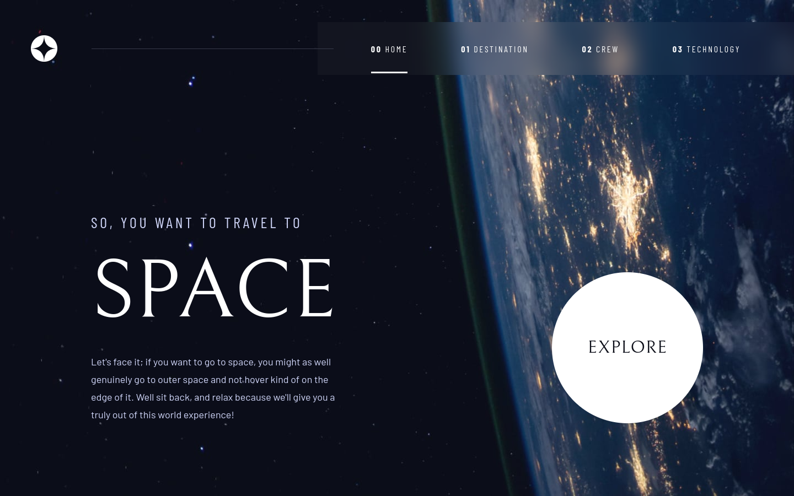
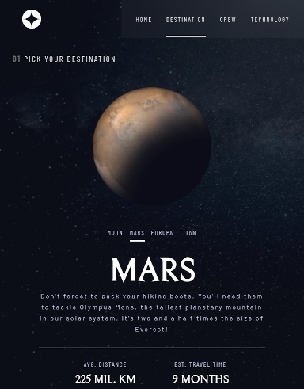
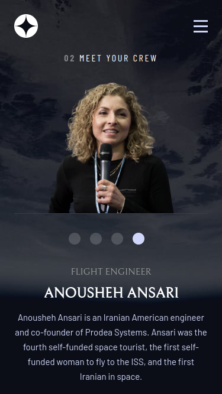
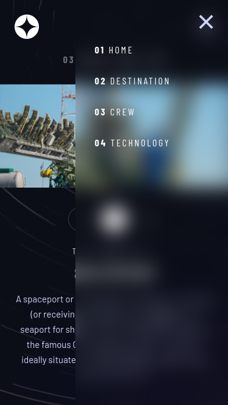

# Frontend Mentor - Space tourism website solution

## Welcome! 👋

Thanks for checking out this repository.

This is a solution to the [Space tourism website challenge on Frontend Mentor](https://www.frontendmentor.io/challenges/space-tourism-multipage-website-gRWj1URZ3). Frontend Mentor challenges help you improve your coding skills by building realistic projects.

## Table of contents

- [Overview](#overview)
  - [The challenge](#the-challenge)
  - [Screenshot](#screenshot)
  - [Links](#links)
- [My process](#my-process)
  - [Built with](#built-with)
  - [What I learned](#what-i-learned)
  - [Useful resources](#useful-resources)
- [Author](#author)

## Overview

### The challenge

Users should be able to:

- View the optimal layout for each of the website's pages depending on their device's screen size
- See hover states for all interactive elements on the page
- View each page and be able to toggle between the tabs to see new information

### Screenshots

#### Home page on desktop screen



#### Destination page on tablet screen



#### Crew page on mobile screen



#### Sidebar view



### Links

- Solution URL: [Solution](https://www.frontendmentor.io/solutions/space-tourism-website-built-with-react-and-sassscss-sijuaf2q55)
- Live Site URL: [Live site](https://michagodfrey.github.io/space)

## My process

### Built with

- SCSS custom properties
- Mobile-first workflow
- [React](https://reactjs.org/) - JS library
- React Router V6
- React Responsive
- Framer Motion

### What I learned

I got more confident installing npm packages and using them for specific effects. For example React Responsive to switch between a landscape and protrait image on mobile/tablet and desktop screen widths. And Framer Motion to add animations.

However, I had problems when I deployed the app on GitHub pages with the Routes and images. I had to change image URL paths and make the home page '/space' rather than '/' because it conflicts with my GH pages user site.

Something I only learned after publishing the site to GitHub Pages, was the limitation of BrowserRouter. Refreshing a page on any page other than '/space' gives a 404 error, and not even my own project error message. I have since learned that HashRouter can solve this problem although that would not be suitable for most websites as it adds a '#' to the URL.

I also got more practice with sass and scss and tried mixins and key frames for the first time. Also the cool glassy effect of the header and sidebar is achieved by a transparent background and backdrop-filter: blur(xxpx); Unfortunately it is not supported by Firefox at the time of creating this project.

```css
  background-color: transparent;
  backdrop-filter: blur(15px);

```

React Responsive. I'm happy with how how it works and think it will come in handy in the future. In this example, the desktop width is set and a simple ternary operator in the image source renders the appropriate image.

```js
  import { useMediaQuery } from "react-responsive";

  const isDesktop = useMediaQuery({ query: '(min-width: 1024px)'});

  
```

Framer Motion. Very impressed with how intuitive it is; after seeing a few examples I was adding cool animations to this project.

```js
import { motion } from 'framer-motion';

  <motion.h5
    initial={{ opacity: 0 }}
    animate={{ opacity: 1 }}
    transition={{ delay: .8, duration: 1 }}
  >
    <b>01</b> pick your destination
  </motion.h5>
  <div className="flexbox destination__content">
  <motion.img
    className="destination__img"
    src={images.webp}
    alt={name}
    initial={{ x: "-30vw", opacity: 0 }}
    animate={{ x: 0, opacity: 1 }}
    transition={{ duration: 1.2, ease: "easeOut" }}
  />

```

### Useful resources

- [Framer Motion for React by The Net Ninja](https://www.youtube.com/watch?v=2V1WK-3HQNk&list=PL4cUxeGkcC9iHDnQfTHEVVceOEBsOf07i&index=1&ab_channel=TheNetNinja) - A great tutorial on Framer Motion.

- [Pluse effect on Explore button](https://www.florin-pop.com/blog/2019/03/css-pulse-effect/) - is created with a CSS keyframe adapted from this example.

## Author

- Website - [My web project showcase](https://michagodfrey.github.io/)
- Frontend Mentor - [@michagodfrey](https://www.frontendmentor.io/profile/michagodfrey)
- Twitter - [@Michael07865192](https://twitter.com/Michael07865192)
